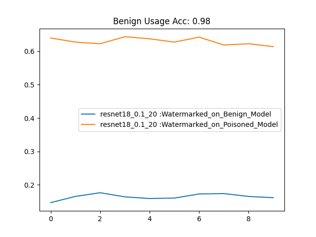

# Audio Watermark

## 1. Prepare dependency
```
conda env create -f dependency.yml  # create env
conda activate audiowatermark       # activate env
```

## 2. Prepare clean dataset
The dataset used in this project is a subset of the [LibriSpeech](http://www.openslr.org/12) dataset. To simplify the experimental setting, this subset contains speech data from only 10 speakers.

You can download our clean dataset from the following link:

[Download Clean Dataset](https://drive.google.com/file/d/17A2cQLvWOAEViNOrzHjd1UTplShC_Irr/view?usp=sharing)


## 3. Prepare benign model

```
python train_all.py --tasks train_benign --sr_model resnet18
```
You can specify the __sr_model__ with other speaker recoginition models. All the models are avaliable in [models].

This will save the benign model to __./checkpoint/benign/XX.pth__

Alternatively, you can download the trained clean model checkpoint from [Checkpoint](https://drive.google.com/file/d/16RVFyEr9SlFlbOb7oQll649yVzKTk3BX/view?usp=sharing). Make sure you place it under ```./code/checkpoint/benign/```


## 4. Generate the watermark
Before generate the watermark, you need to prepare the following:
 - a style encoder/token model GST [Checkpoint](https://drive.google.com/file/d/1P-l8-TyLL3uITltDeWaF4CjJ9X93RNFw/view?usp=sharing)
 - a deepafx style model [Checkpoint](https://drive.google.com/drive/folders/1D_htOC4gHn0PMBeRu7fe_3UEJ-bGbc-e?usp=sharing)
 - a trained style_waveunet [Checkpoint](https://drive.google.com/file/d/1ZAO2kp3VjS52drGsIFl95x8mYuoHF4UM/view?usp=sharing) __Alternatively, you can train it by yourself, the bi-level optimization process can be found in <train_opt.py>__

The structure of the checkpoint folder is:

```plaintext
checkpoint/
├── benign/
│   └── resnet18_1001212025.pth
├── poisoned_model/
│   └── resnet18_20_10.0.pth
├── 50_waveunet.pth
├── deepafx_comp.ckpt
├── deepafx_peq.ckpt
├── deepafx_style.ckpt
└── gst.pth
``````

Once you have the models, you can generate the watermark samples by 
```
python verify_watermark.py -g
```
This will creat a dataset that only contain watermarked data samples. For each clean sample, we generate a watermarked version based on our proposed approach. It will be saved into __<poison_data_path>__.

## 5. Verify the watermark

Now, you have the watermarked sample, we mixed the watermarked sample and the clean sample together, to create the watermarked dataset. The structure of the watermarked dataset can be found in __<load_data/PoisonedLibriDataset()>__

You can specify the poison rate and training epoch.
```
python verify_watermark.py -e -pr 0.1 -epoch 20
```
Here, the <0.1> is poison rate and <20> is poison epoches.
This code will first poison the benign model to watermarked model. Then, we will randomly generate watermark samples, and check the recognition accuracy for benign model and watermarked model. 
__We expect the watermarked model has__
- __<higher_accuracy>__ on watermarked testing samples.
- __<high_accuracy>__ on benign samples.

Meanwhile, we expect the benign model cannot correctly recognize the watermarked samples, show low accuracy on watermarked samepls.

__[Important:]__ The testing watermarked sample is different from the watermark dataset, which means, the watermark is dynamic, because the watermark pattern is not fixed, instead, it can be from any speaker, as long as it is generated by the style transfer models.

For a watermarked model, we genreate watermark samples in 10 rounds. In each round, we generate __900__ watermark samples, each sample is generated by adding style to a random clean sample with random reference. Below is the evaluation result, the x is the round number, and y is accuracy. It is clear to see that the watermarked sample show better performance on watermarked model. Meanwhile, the watermarked model maintain high accuracy for clean data.

The x is testing epochs. For each epoch, we generate 



The audio demos, more models, and noise sources, can be found in our code, and our demo website [webpage](https://audiowatermark.github.io/)


